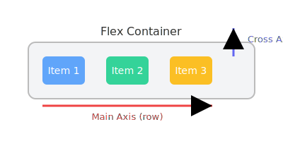
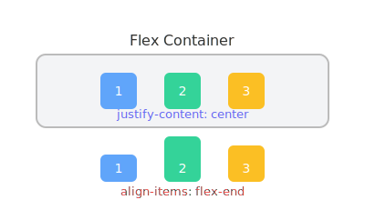

# CSS Flexbox: The Ultimate Guide 🚀

---

## 📚 Table of Contents
1. [✨ Introduction](#introduction)
2. [💡 Why Use Flexbox?](#why-use-flexbox)
3. [🔰 Getting Started: Basic Syntax](#getting-started-basic-syntax)
4. [🧩 Flex Container Properties](#flex-container-properties)
    - [🖼️ display](#display)
    - [↔️ flex-direction](#flex-direction)
    - [🔄 flex-wrap](#flex-wrap)
    - [🔀 flex-flow](#flex-flow)
    - [📏 justify-content](#justify-content)
    - [🧲 align-items](#align-items)
    - [🧲 align-content](#align-content)
    - [🪢 gap, row-gap, column-gap](#gap-row-gap-column-gap)
5. [🎯 Flex Item Properties](#flex-item-properties)
    - [🌱 flex-grow](#flex-grow)
    - [📉 flex-shrink](#flex-shrink)
    - [📦 flex-basis](#flex-basis)
    - [🧮 flex](#flex)
    - [🎚️ align-self](#align-self)
6. [🪞 Nested Flexbox](#nested-flexbox)
7. [🧩 Common Flexbox Patterns](#common-flexbox-patterns)
8. [🖼️ Layout Examples](#layout-examples)
9. [🖌️ Visual Illustrations & Diagrams](#visual-illustrations-diagrams)
10. [✅ Do's and ❌ Don'ts](#dos-and-donts)
11. [🌍 Real-World Use Cases](#real-world-use-cases)
12. [🏆 Best Practices](#best-practices)
13. [🧑‍💻 Interactive Code Examples](#interactive-code-examples)
14. [📖 Resources & Further Reading](#resources-further-reading)

---

## 🗂️ Flexbox Properties at a Glance

| Property                | Emoji  | Description                                 |
|------------------------|--------|---------------------------------------------|
| `display`              | 🖼️     | Defines a flex container                    |
| `flex-direction`       | ↔️     | Main axis direction                        |
| `flex-wrap`            | 🔄     | Wraps items to new lines                    |
| `flex-flow`            | 🔀     | Shorthand for direction & wrap              |
| `justify-content`      | 📏     | Aligns items on main axis                   |
| `align-items`          | 🧲     | Aligns items on cross axis                  |
| `align-content`        | 🧲     | Aligns rows on cross axis                   |
| `gap`                  | 🪢     | Space between items                         |
| `flex-grow`            | 🌱     | Item growth factor                          |
| `flex-shrink`          | 📉     | Item shrink factor                          |
| `flex-basis`           | 📦     | Initial item size                           |
| `flex`                 | 🧮     | Shorthand for grow, shrink, basis           |
| `align-self`           | 🎚️     | Individual item alignment                   |

---

## ✨ Introduction
> **CSS Flexbox** (Flexible Box Layout) is a powerful layout module that makes it easy to design flexible, responsive layout structures without using float or positioning. Flexbox is ideal for arranging items in a single dimension (row or column) and distributing space dynamically.

---

## 💡 Why Use Flexbox?
- 📱 **Responsive Design:** Easily adapts to different screen sizes.
- 🎯 **Alignment:** Vertically and horizontally center items with ease.
- 🔢 **Ordering:** Change the visual order of elements without altering the HTML.
- 📏 **Space Distribution:** Distribute space between items or around them.
- 🛠️ **Simplifies Complex Layouts:** Reduces the need for floats and positioning hacks.

---

## 🔰 Getting Started: Basic Syntax

<!-- tabs:start -->
#### **HTML**
```html
<div class="container">
  <div class="item">1️⃣</div>
  <div class="item">2️⃣</div>
  <div class="item">3️⃣</div>
</div>
```
#### **CSS**
```css
.container {
  display: flex;
  justify-content: center;
  align-items: center;
  gap: 1rem;
}
.item {
  background: #60a5fa;
  color: #fff;
  padding: 1rem 2rem;
  border-radius: 8px;
  font-size: 1.5rem;
}
```
<!-- tabs:end -->

---

## 🧩 Flex Container Properties
### 🖼️ display
- `flex`: Block-level flex container
- `inline-flex`: Inline-level flex container

### ↔️ flex-direction
Defines the main axis direction.
- `row` (default): left to right ➡️
- `row-reverse`: right to left ⬅️
- `column`: top to bottom ⬇️
- `column-reverse`: bottom to top ⬆️

**Example:**
```css
.container {
  flex-direction: row; // ➡️
}
```

### 🔄 flex-wrap
Controls whether flex items wrap onto multiple lines.
- `nowrap` (default)
- `wrap`
- `wrap-reverse`

**Example:**
```css
.container {
  flex-wrap: wrap; // 🔄
}
```

### 🔀 flex-flow
Shorthand for `flex-direction` and `flex-wrap`.
```css
.container {
  flex-flow: row wrap; // 🔀
}
```

### 📏 justify-content
Aligns items along the main axis.
- `flex-start` (default) |⬅️
- `flex-end` ➡️|
- `center` ⬅️|➡️
- `space-between` |⬅️  ➡️|
- `space-around` | ⬅️  ➡️ |
- `space-evenly` | ⬅️ ➡️ |

**Example:**
```css
.container {
  justify-content: space-between; // 📏
}
```

### 🧲 align-items
Aligns items along the cross axis.
- `stretch` (default)
- `flex-start` ⬆️
- `flex-end` ⬇️
- `center` ⬆️⬇️
- `baseline`

**Example:**
```css
.container {
  align-items: center; // 🧲
}
```

### 🧲 align-content
Aligns rows of items when there is extra space in the cross axis.
- `stretch` (default)
- `flex-start` ⬆️
- `flex-end` ⬇️
- `center` ⬆️⬇️
- `space-between`
- `space-around`
- `space-evenly`

**Example:**
```css
.container {
  align-content: space-around; // 🧲
}
```

### 🪢 gap, row-gap, column-gap
Controls spacing between flex items.
```css
.container {
  gap: 16px; // 🪢
  row-gap: 8px;
  column-gap: 24px;
}
```

---

## 🎯 Flex Item Properties
### 🌱 flex-grow
Defines how much a flex item will grow relative to the rest.
```css
.item {
  flex-grow: 2; // 🌱
}
```

### 📉 flex-shrink
Defines how much a flex item will shrink relative to the rest.
```css
.item {
  flex-shrink: 1; // 📉
}
```

### 📦 flex-basis
Defines the initial size of a flex item before space is distributed.
```css
.item {
  flex-basis: 200px; // 📦
}
```

### 🧮 flex
Shorthand for `flex-grow`, `flex-shrink`, and `flex-basis`.
```css
.item {
  flex: 1 0 150px; // 🧮
}
```

### 🎚️ align-self
Overrides `align-items` for individual flex items.
```css
.item {
  align-self: flex-end; // 🎚️
}
```

---

## 🪞 Nested Flexbox
> 🪞 **Tip:** You can nest flex containers for advanced layouts!

```html
<div class="outer">
  <div class="inner">
    <div class="item">A</div>
    <div class="item">B</div>
  </div>
</div>
```
```css
.outer {
  display: flex;
}
.inner {
  display: flex;
  flex-direction: column;
}
```

---

## 🧩 Common Flexbox Patterns
- **Centering Content:**
  ```css
  .center {
    display: flex;
    justify-content: center;
    align-items: center;
  }
  ```
- **Equal-Width Columns:**
  ```css
  .columns > div {
    flex: 1;
  }
  ```
- **Sticky Footer:**
  ```css
  .container {
    display: flex;
    flex-direction: column;
    min-height: 100vh;
  }
  .footer {
    margin-top: auto;
  }
  ```

---

## 🖼️ Layout Examples
### Responsive Navbar
```html
<nav class="navbar">
  <div>🏠 Logo</div>
  <div>🔗 Links</div>
  <div>👤 Profile</div>
</nav>
```
```css
.navbar {
  display: flex;
  justify-content: space-between;
  align-items: center;
}
```

### Card Grid
```html
<div class="card-grid">
  <div class="card">1️⃣</div>
  <div class="card">2️⃣</div>
  <div class="card">3️⃣</div>
</div>
```
```css
.card-grid {
  display: flex;
  gap: 16px;
}
.card {
  flex: 1;
}
```

---

## 🖌️ Visual Illustrations & Diagrams

### Flexbox Axes

*Main Axis vs Cross Axis in a flex container (row direction)*

### Flexbox Properties

*How justify-content and align-items affect flex items*

---

## ✅ Do's and ❌ Don'ts
**✅ Do:**
- Use flexbox for one-dimensional layouts.
- Combine with media queries for responsiveness.
- Use `gap` for spacing instead of margins.

**❌ Don't:**
- Use flexbox for complex two-dimensional layouts (use CSS Grid).
- Over-nest flex containers.
- Rely on flexbox for equal heights in all browsers (use min-height as fallback).

---

## 🌍 Real-World Use Cases
- 🧭 Navigation bars
- 🃏 Card layouts
- 🎯 Centering content
- 📝 Responsive forms
- 📎 Sticky footers
- 🛠️ Toolbars

---

## 🏆 Best Practices
> 🏅 **Best Practice:** Prefer `gap` over margins for spacing.
> 
> 🏅 Use shorthand properties for cleaner code.
> 
> 🏅 Test layouts across browsers.
> 
> 🏅 Combine with CSS Grid for complex layouts.

---

## 🧑‍💻 Interactive Code Examples
Try out Flexbox live:
- [🐸 Flexbox Froggy](https://flexboxfroggy.com/)
- [📝 CSS Tricks Flexbox Guide](https://css-tricks.com/snippets/css/a-guide-to-flexbox/)
- [🛡️ Flexbox Defense](http://www.flexboxdefense.com/)
- [🎮 Flexbox Zombies](https://mastery.games/p/flexbox-zombies)

> 💡 **Tip:** Use [CodePen](https://codepen.io/) or [JSFiddle](https://jsfiddle.net/) to experiment with your own Flexbox layouts interactively!

---

## 📖 Resources & Further Reading
- [🌟 Josh W Comeau: An Interactive Guide to Flexbox (The world's best Flexbox resource)](https://www.joshwcomeau.com/css/interactive-guide-to-flexbox/)

---

## ❓ FAQ: Frequently Asked Questions

**Q: Why isn't my Flexbox layout working?**
- Make sure the parent has `display: flex` or `display: inline-flex`.
- Only direct children of the flex container become flex items.

**Q: How do I center an item both vertically and horizontally?**
```css
.container {
  display: flex;
  justify-content: center;
  align-items: center;
}
```

**Q: Why aren't my items wrapping?**
- Check that you've set `flex-wrap: wrap` on the container.

**Q: Why is there unexpected space or overflow?**
- Check for default margins/padding on child elements or the container.
- Use `box-sizing: border-box;` for more predictable sizing.

---

## 🐞 Troubleshooting Common Flexbox Issues

- **Flex items not aligning as expected:**
  - Double-check `align-items`, `justify-content`, and `align-self` values.
- **Items overflowing the container:**
  - Use `min-width: 0;` or `overflow: hidden;` on flex items if needed.
- **Images or content not shrinking:**
  - Set `min-width: 0;` or `min-height: 0;` on the flex item.
- **Flexbox not working in older browsers:**
  - Check for vendor prefixes or use [Autoprefixer](https://autoprefixer.github.io/).

---

> **Designed for clarity, beauty, and usability.**
> 
> _For best results, add your own diagrams to the `images/` folder as referenced above._
> 


---

<p align="center">
  <b>Happy coding!</b> 🚀
</p>

## 👨‍💻 About the Author

**Sajib Bhattacharjee**
MERN Stack Specialist | Full-Stack Web Developer

- 🌐 [Portfolio & Projects](https://github.com/Sajib-Bhattacharjee)
- 💼 [LinkedIn](https://www.linkedin.com/in/sajib-bhattacharjee-42682a178/)
- 📧 [Contact Me](mailto:sajibbhattacjarjee2000@gmail.com)

---

<p align="center"><i>Created with ❤️ — 2025 Edition</i></p>
